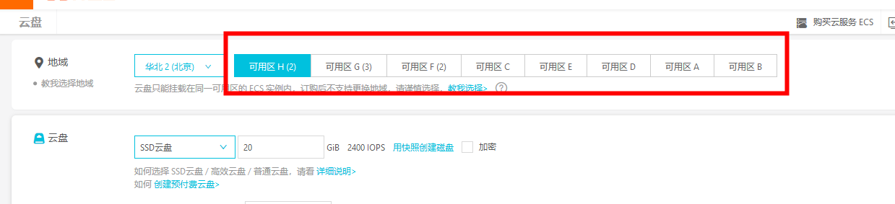
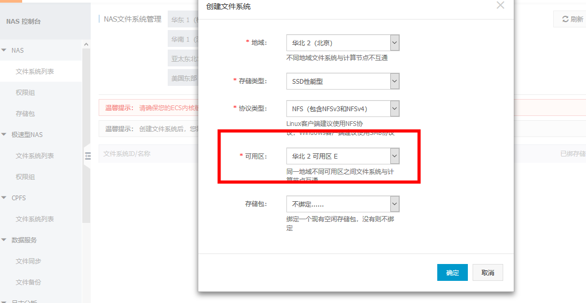

# 目录结构
```
├── README.md
├── config-exercise # config 配置练习 
├── dev # 测试服配置文件
├── examples # 示例
├── index.js
├── index.yml
├── node_modules
├── package.json
├── practices # 实践
├── swarm.json # 迁移应用原始信息
├── src  # 配置文件目录
├── system # 系统应用配置
```

`jetbrains` 可以安装 `kubernetes` 插件,方便书写配置文件


# 最佳实践
https://kubernetes.io/docs/concepts/configuration/overview/

- 可以将配置文件放在一个文件,[示例](https://github.com/kubernetes/examples/blob/master/guestbook/all-in-one/guestbook-all-in-one.yaml) 不做强制要求,在只想更新单个时不是很方便

## kubectl 命令表
https://kubernetes.io/docs/reference/kubectl/cheatsheet/

### 创建 docker 镜像秘钥

```
kubectl create secret docker-registry qingdao-docker --docker-server=registry.cn-beijing.aliyuncs.com --docker-username=username --docker-password=password --docker-email=email
# 或者使用
kubectl create secret generic beijingvpcdocker \
    --from-file=.dockerconfigjson=/root/.docker/config-bj.json \
    --type=kubernetes.io/dockerconfigjson
```
加入到 `serviceaccoun` `imagePullSecrets` 配置中

这样会替换掉原秘钥，最好手动编辑 `kubectl edit`
`kubectl patch serviceaccount default -p '{"imagePullSecrets": [{"name": "beijingdocker"}]}'`


# 踩坑记录
## docker swarm 配置文件转 k8s

[阿里云预处理Swarm编排文件](https://help.aliyun.com/document_detail/120292.html?spm=a2c4g.11186623.6.845.5fd62bd2C7zjcW)
示例:`kompose-darwin-amd64 convert -f users-service.yaml`
`label`为 `aliyun.routing.port_80: "http://wechat.kaoyaya.com,http://wechat2.kaoyaya.com"`会自动生成`*-service.yaml`,`*-ingress.yaml`文件
## https 配置

负载均衡配置 443 端口监听 `ingress` 80 端口,同时 `ingress` 需要配置具体的域名

## 负载均衡不要监听虚拟服务器组
伸缩 `ingress-ingix-controller` 时,会导致监听的虚拟服务器组被移除.改为监听主服务器组.

## websocket 配置
阿里云 `ingress` 是在 `kubernetes-ingress` 基础上改进的.
https://github.com/nginxinc/kubernetes-ingress/tree/master/examples/websocket#websocket-support
阿里云已经封装好了,不需要加注解也可以的

## 资源限制
https://kubernetes.io/docs/concepts/configuration/manage-compute-resources-container/#how-pods-with-resource-requests-are-scheduled
资源检查是按 `pod` 申请来计算的,而不是正在使用的资源.
当 `pod` 需要的资源不足时将不会被调度
`kubectl describe nodes node`查看 可分配的资源

## pod 自动扩容 HPA(Horizontal Pod Autoscaler)
算法详情
https://kubernetes.io/docs/tasks/run-application/horizontal-pod-autoscale/#algorithm-details
> desiredReplicas = ceil[currentReplicas *(currentMetricValue/desiredMetricValue)]

所以自动扩容需要设置 `pod` `request resource`才会生效.
容器扩容后,如果资源消耗在正常访问内,默认5分钟缩容.
可以使用 `kubectl describe horizontalpodautoscalers.autoscaling fe`

## 将节点改为维护状态
https://kubernetes.io/docs/tasks/administer-cluster/safely-drain-node/
https://kubernetes.io/docs/reference/kubectl/cheatsheet/#interacting-with-nodes-and-cluster
- 1. `kubectl drain my-node` 可以将该节点 `pod` 清空, `pod`会调度到其他 `node`
- 2. `kubectl cordon my-node` 将节点标记为不可调度,这一步会自动执行
- 3. `kubectl uncordon my-node` 将节点标记为可调度.

# consul 安装

使用 aliyun 市场应用目录 helm 发布 consul,需要删除原 `StrongClass`,创建多可用区 `StrongClass`,使用
`src/pv/alicloud-disk-efficiency-sc.yaml:11`文件创建.
PS: 创建云盘/NAS时都需要注意选择可用区


创建 `oss` 则不用选择可用区
