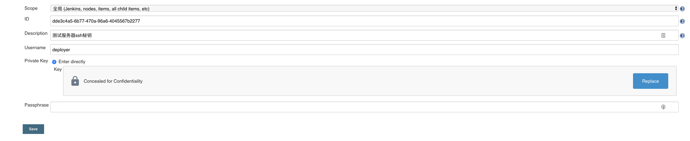

# 关键配置
## Credentials
### ssh秘钥配置
- 从jenkin服务~/.ssh目录分别获取id_rsa，id_rsa.pub文件的内容
- 创建deployer账号`useradd deployer`
- 切换deployer账号
- 将id_rsa.pub的内容添加到`~/.ssh/authorized_keys`文件中
- 将k8s连接的配置文件复制到`~/.kube`文件夹中
- 将id_rsa内容添加至



## docker remote api 配置
jenkins构建docker需要依赖外部的docker服务
` vi /usr/lib/systemd/system/docker.service`添加关键性的配置`-H tcp://0.0.0.0:4243`
```
[Service]
ExecStart=/usr/bin/dockerd -H tcp://0.0.0.0:4243  -H fd:// --containerd=/run/containerd/containerd.sock
```