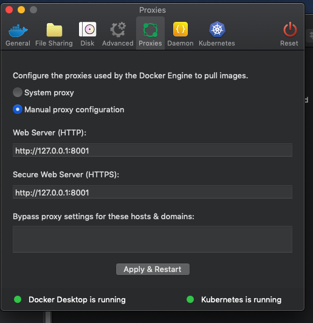
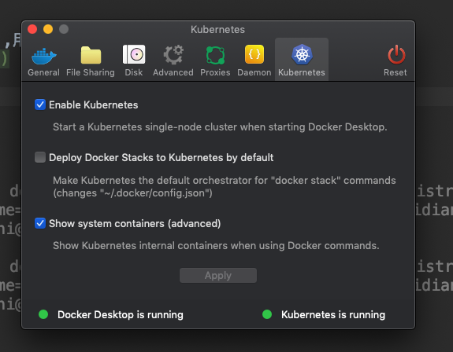
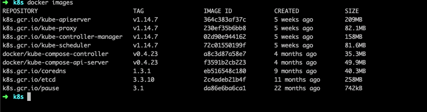
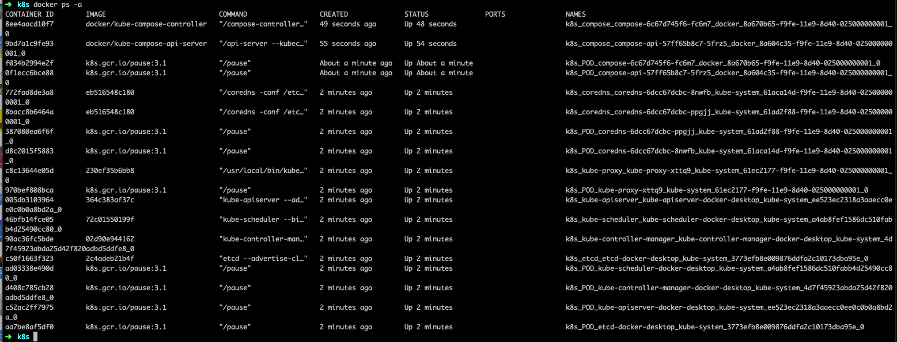

## 本地k8s环境部署

## 步骤
### 下载并安装docker for mac
- [阿里云下载](http://mirrors.aliyun.com/docker-toolbox/mac/docker-for-mac/stable/) 
- 官方下载

### 设置docker proxy
- 设置vpn用于拉取google镜像 !!!!重要
- 等待拉取镜像启动k8s

### 开启kubernetes模块

### 等待kubernetes启动
- 检查镜像是否能够正常下载

### 创建镜像拉取秘钥 !!!!重要

- 青岛 `kubectl create secret docker-registry beijing --docker-server=registry.cn-beijing.aliyuncs.com --docker-username=xuqizhi@gmail.com --docker-password=Caishidian168\* --docker-email=xuqizhi@gmail.com`

- 北京 `kubectl create secret docker-registry qingdao --docker-server=registry.cn-qingdao.aliyuncs.com --docker-username=xuqizhi@gmail.com --docker-password=Caishidian168\* --docker-email=xuqizhi@gmail.com`
  
### 创建 [NGINX Ingress Controller](https://kubernetes.github.io/ingress-nginx/deploy/#generic-deployment)

- 创建namespace`kubectl apply -f ./namespcaes.yaml`
- `kubectl apply -f ./mandatory.yaml`
- `kubectl apply -f ./cloud-generic.yaml`
- `kubectl get -n ingress-nginx pods`

## 部署应用
- `kubectl apply -f ./app/backend/go-api`
- 添加`127.0.0.1 www.kyy.com`至`/etc/hosts`文件
- `curl www.kyy.com/api/v1/oem`

## 常用命令

- 查看ingress-nginx 配置文件
` kubectl exec -it -n ingress-nginx  nginx-ingress-controller-${id} cat /etc/nginx/nginx.conf`

 > 文件形式` kubectl exec -it -n ingress-nginx  nginx-ingress-controller-${id} cat /etc/nginx/nginx.conf > nginx.conf`
 

Caishidian168*